# Anderson de Souza

**Analista em transição para Desenvolvedor Full Stack** 
Sistemas ERP · Firebird/SQL · PHP · JavaScript · Python

Tangará da Serra, MT · Aberto a oportunidades e colaborações

## Sobre mim

Trabalho como analista com sistemas ERP e estou migrando para o desenvolvimento Full Stack. Boa parte do que construo nasce da rotina de suporte: um portal de tutoriais do ERP TGA, painéis internos para equipes e scripts em Python para rotinas com banco Firebird.

Também desenvolvo sites para pequenos negócios locais, com agendamento e contato direto por WhatsApp.

**Objetivo:** consolidar a base Full Stack (PHP, JavaScript e Python) e atuar profissionalmente como desenvolvedor.

## Stack

**Front-end** 

**Back-end** 

**Banco de dados** 

**Ferramentas e deploy** 

## Projetos em destaque

### [Tutoriais TGA](https://tgameajuda.com/)
Portal que centraliza manuais, tutoriais, downloads e ferramentas de suporte para usuários do ERP TGA, com notificações em tempo real. 
`HTML` `CSS` `JavaScript` `PHP` `Firebase` · **Status:** em uso · [Repositório](https://github.com/souzaseven/tgahelpme)

### [Afiação Almeida](https://souzaseven.github.io/afiacao.almeida/)
Site de um serviço local, com agendamento online, galeria de antes/depois, calendário de horários e contato por WhatsApp. 
`PHP` `HTML` `CSS` `JavaScript` · **Status:** publicado · [Repositório](https://github.com/souzaseven/afiacao.almeida)

### [Portfólio](https://site2-jade-chi.vercel.app/)
Site pessoal que reúne meus projetos e informações profissionais. 
`HTML` `CSS` `JavaScript` · **Status:** publicado · [Repositório](https://github.com/souzaseven/Site2)

Outros projetos e exercícios de estudo estão em [repositórios](https://github.com/souzaseven?tab=repositories).

## Em foco agora

| Nível | Tecnologias |
|---|---|
| **Utilizando** | HTML, CSS, JavaScript, PHP, Firebird/SQL |
| **Praticando** | Python (automação e scripts de banco), MySQL |
| **Estudando** | Frameworks JavaScript, fluxo com Git/GitHub, IA aplicada ao desenvolvimento |

## Atividade no GitHub

<picture>
  <source media="(prefers-color-scheme: dark)" srcset="./profile/stats-dark.svg">
  
</picture>
<picture>
  <source media="(prefers-color-scheme: dark)" srcset="./profile/top-langs-dark.svg">
  
</picture>

O card de linguagens mostra a composição do código nos repositórios públicos, não o nível de domínio de cada linguagem.

<picture>
  <source media="(prefers-color-scheme: dark)" srcset="https://streak-stats.demolab.com?user=souzaseven&theme=github-dark-blue&hide_border=true&locale=pt_BR">
  
</picture>

<picture>
  <source media="(prefers-color-scheme: dark)" srcset="https://github-profile-summary-cards.vercel.app/api/cards/profile-details?username=souzaseven&theme=github_dark">
  
</picture>

<picture>
  <source media="(prefers-color-scheme: dark)" srcset="https://github-profile-summary-cards.vercel.app/api/cards/productive-time?username=souzaseven&theme=github_dark&utcOffset=-4">
  
</picture>

<picture>
  <source media="(prefers-color-scheme: dark)" srcset="https://raw.githubusercontent.com/souzaseven/souzaseven/output/github-contribution-grid-snake-dark.svg">
  
</picture>

## Contato

[LinkedIn](https://www.linkedin.com/in/anderson-s-352605137) · [Portfólio](https://site2-jade-chi.vercel.app/)

Outras redes

 

[YouTube](https://www.youtube.com/channel/UCfm72qf2H8ze39A9mSAq-yg) · [Instagram](https://www.instagram.com/andersondsouza7/) · [TikTok](https://www.tiktok.com/@andersondesouza09) · [Facebook](https://www.facebook.com/anderson.desouza.5661/) · [Blog](https://andersondsouza.blogspot.com/2017/02/comecando-do-zero.html)

